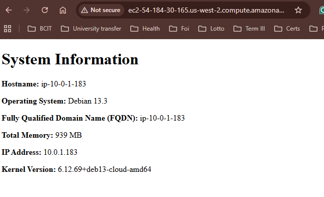

# acit4640-lab-wk7
Salome Chelsie Lele Wambo - A01372274

## Creating the ssh keypair

`ssh-keygen -t ed25519 -f ~/.ssh/aws -C "lelechelsie@gmail.com"`

## Running scripts:
1. import_lab_key
inside ~/acit-4640/intro-to-ansible-lab-files/scripts:
`./import_lab_key ~/.ssh/aws`

2. terraform
`terraform init` initialize directory and downloads plugins
`terraform fmt` to nicely format
`terraform validate` to validate the syntax
`terraform plan -out first_plan` create the plan and writes to file 'first_plan'
`terraform apply` to apply the configuration

3. Ansible
`ansible-playbook playbook.yml --syntax-check` to check the playbook
`ansible-playbook playbook.yml --check` to see what would change, similar to `terraform plan` without actually making any change.
`ansible-playbook playbook.yml` to run the playbook. Has to be run from inside the `/ansible` directory

4. Screenshot

5. Destroying resources
`terraform destroy`